# Table of Contents

- [Summary](#summary)
- [Unsupervised Learning](#unsupervised-learning)
  - [Hierarchical Agglomerative Clustering](#hierarchical-agglomerative-clustering)
    - [Visualizations](#visualizations)
    - [Results](#results)
  - [K-means Clustering](#k-means-clustering)
- [Supervised Learning](#supervised-learning)
  - [Decision Tree](#decision-tree)
    - [The Model](#the-model)
    - [Data Pre-processing](#data-pre-processing)
    - [Decision Tree Implementation](#decision-tree-implementation)
    - [Results](#results)
    - [Conclusions](#conclusions)

# Summary

We are making use of a [Spotify dataset](https://www.kaggle.com/yamaerenay/spotify-dataset-19212020-160k-tracks) consisting of 160,000 songs in order to understand the interesting correlations that exist between a song's popularity and other features such as instrumentalness, speechiness, danceability, etc. We believe that by making use of different visualizations and agglomeration methods, insightful relations might be discovered. Ultimately, our goal is to apply data science and machine learning to better understand what makes a song popular.

# Unsupervised Learning

## Hierarchical Agglomerative Clustering

### Visualizations

The first thing we did after reading the data from the spotify dataset was separate the columns into numerical features and categorical features.

```py
data_num = data[['acousticness', 'danceability', 'duration_ms', 'energy',
       'instrumentalness', 'liveness', 'loudness', 'popularity',
       'speechiness', 'tempo', 'valence', 'year']]
data_cat = data[['explicit', 'mode', 'key']]

```

Then, we plotted the distributions of each numeric feature to get a sense of how each variable is distributed. The following are just some of the generated histograms.

```py
#distributions for all numeric variables
for i in data_num.columns:
    plt.hist(data_num[i])
    plt.title(i)
    plt.show()
```

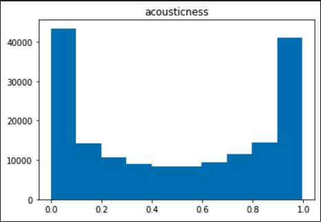
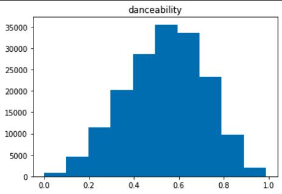
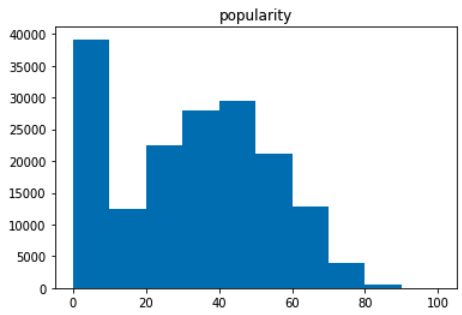

To see the correlations that exist between every single numerical feature, we ran the following heatmap, which already displays some interesting relations.

```py
# visualize correlations between numerical attributes with heatmap
sns.heatmap(data_num.corr())
```

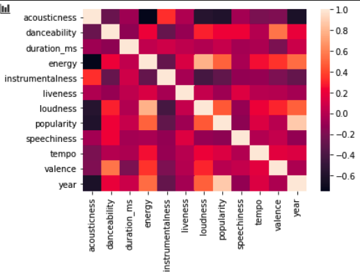

An interesting exploration of the data was the comparison between the categorization of a song as 'explicit' and features such as energy, speechiness, and year.

```py
# compare Explicit rating across some numerical variables
pd.pivot_table(data, index = 'explicit', values = ['year', 'instrumentalness', 'acousticness', 'energy', 'speechiness'])
```

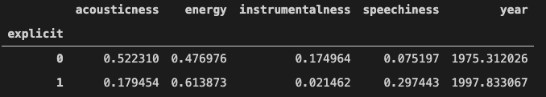

Another heatmap showing the correlation of various features. This would prove useful later when deciding which values to compare on a scatterplot.

#### Correlation of Features

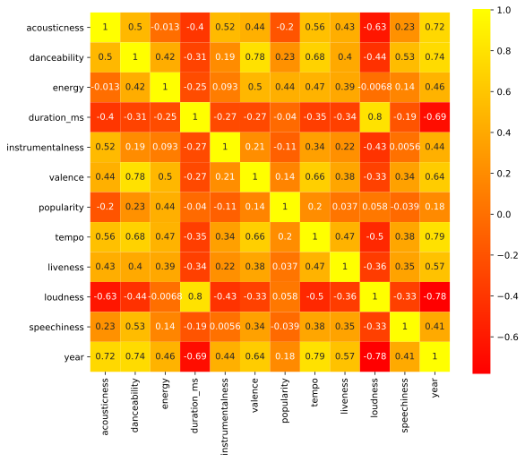

We then decided to try hierarchical clustering considering the simplicity of the data. We created a dendrogram through agglomerative clustering in order to visualize the outlook of the clusters. After looking at the denderogram, we decided on decisive clustering with 2 clusters.

#### Dendrogram

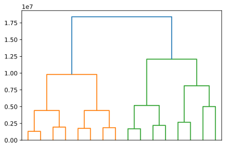

In the last visualization, we created a scatterplot of the loudness and duration in milliseconds of the songs after clustering.

#### Loudness v. Duration (ms) after Clustering


### Results

The result of the hierarchical agglomerative clustering with 2 clusters is 2 clear groups: a cluster with small duration and a large range of loudness and a cluster with long duration and a slightly smaller range of loudness that is, on average, louder.

## K-means Clustering

```py
plt.style.use("fivethirtyeight")
plt.plot(range(1, 11), sse)
plt.xticks(range(1, 11))
plt.xlabel("Number of Clusters")
plt.ylabel("SSE")
plt.show()
```

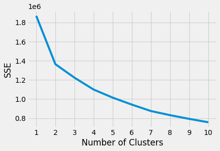

# Supervised Learning

## Decision Tree

For the supervised learning part, we chose a Decision Tree as our learning method given the multi-class nature of our data.

### The Model

Before actually creating the supervised learning model, we made a simple representation of a decision tree with just two leaf nodes that splits the data based on “speachiness” to determine popularity.

Although the actual model is much more complex, here it can be appreciated how the decision tree finds an appropriate point to split the data that lowers the error on each subsequent leaf node.

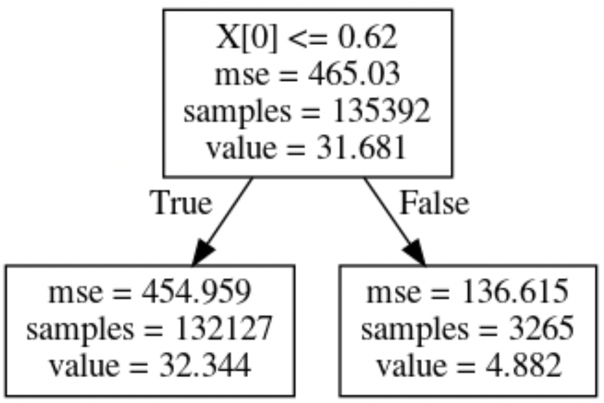

### Data Pre-processing

We used a dataset with information about spotify songs and their features including: acousticness, danceability, energy, year, loudness, popularity… (16 columns, 169,909 rows)

1. removed the id, name, and release date columns
2. removed the duplicate cells
3. Transform artist string name to float (representing popularity of artist).
4. replaced zeros in tempo column.
5. scaled the data by dividing popularity by 100

### Decision Tree Implementation

We then created a supervised model based on iterating through train and test data to find an optimal number of leaf nodes for our decision tree.
As can be observed, as the maximum number of leaves increased, the Mean Squared Error of both the training set and testing set decreased.
We decided a stop point of 178 max leaf nodes as an appropriate limit to the size of our tree.

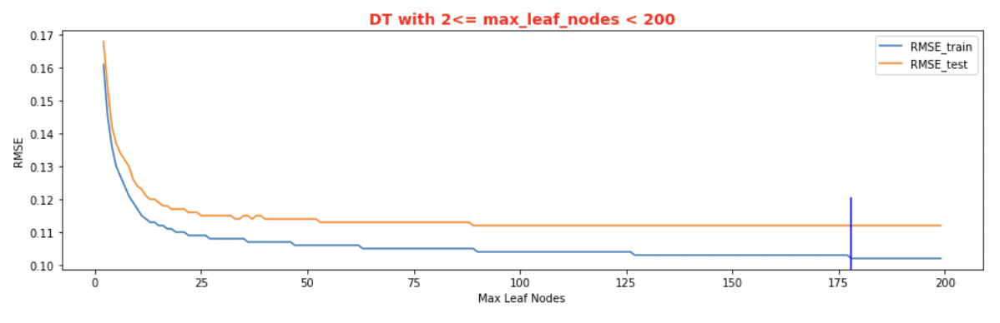

After comparing the actual popularity with the prediction from our decision tree, we did find a lot of variance but the correlation was in the expected direction.

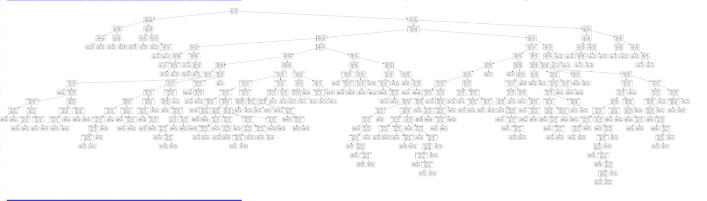
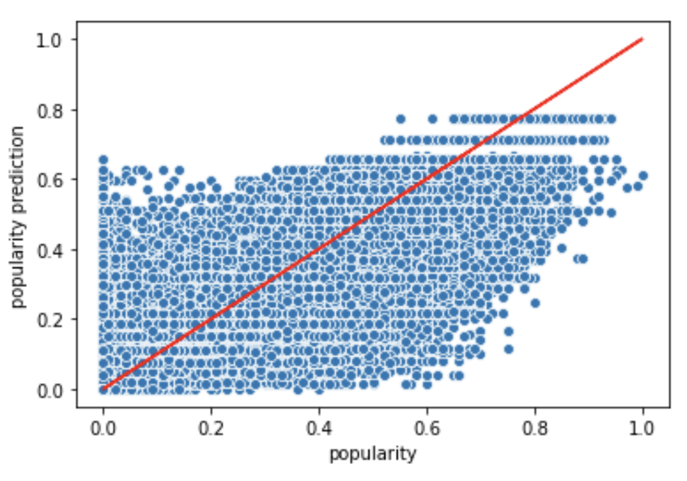

### Results

Decision Tree run with
test size = 0.2,
max leaf nodes = 178,
min threshold of artist popularity = 2.

train RMSE of 0.102
test RMSE of 0.112.

### Conclusions

After creating and running an algorithm for finding a decision tree with a maximum of 200 leaves, we found that although this model might not be ideal for this sort of problem, it nevertheless achieved some successful predicting power. We noticed that the accuracy of tree increases with more nodes, but we still had quite varying results when comparing our predicted popularity with the actual one.

Deciding on how to classify the artist feature (string), which we ended up using the artists mean popularity as a float. The use of the dataset is challenging as more cleaning could improve our results, and we could try another more effective algorithm.
